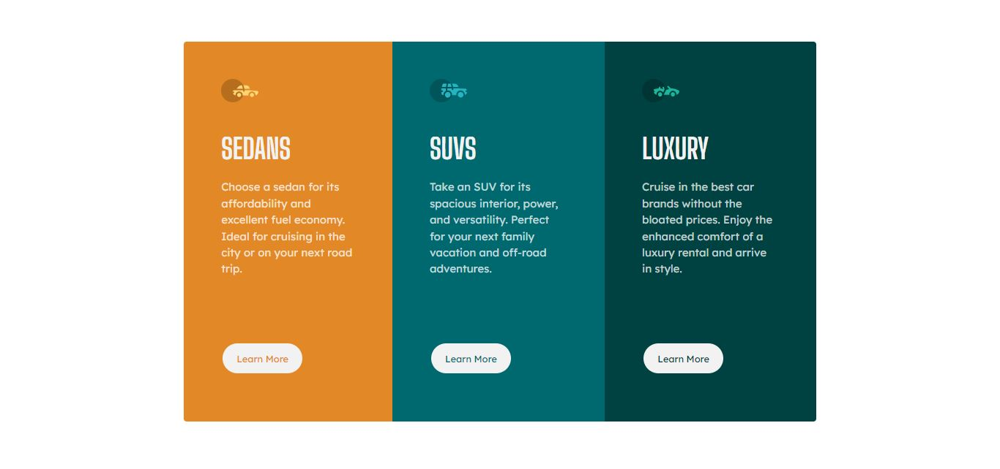

# Frontend Mentor - Solución del desafío 3-column preview card component

Esta es una solución para el [3-column preview card component challenge on Frontend Mentor](https://www.frontendmentor.io/challenges/3column-preview-card-component-pH92eAR2-). Los desafíos de Frontend Mentor te ayudan a mejorar tus habilidades de codificación mediante la construcción de proyectos realistas.

## Tabla de contenidos

- [Visión general](#visión-general)
  - [El desafío](#el-desafío)
  - [Captura de pantalla](#captura-de-pantalla)
  - [Enlaces](#enlaces)
- [Mi proceso](#mi-proceso)
  - [Construido con](#construido-con)
  - [Lo que aprendí](#lo-que-aprendí)
  - [Desarrollo continuo](#desarrollo-continuo)
  - [Recursos útiles](#recursos-útiles)
- [Autor](#autor)

## Visión general

### El desafío

Los usuarios deberían poder:

- Ver el diseño óptimo dependiendo del tamaño de pantalla de su dispositivo.
- Ver estados de hover para elementos interactivos.

### Captura de pantalla

### Enlaces

- URL de la solución: [GitHub](https://github.com/ReyCrisGit/3-column-preview-card-component-main.git)
- URL del sitio en vivo: [GigHubPages](https://reycrisgit.github.io/3-column-preview-card-component-main/)

## Mi proceso

### Construido con

- Marcado HTML5 semántico
- Propiedades personalizadas de CSS
- Flexbox

### Lo que aprendí

El manejo de hover.

### Desarrollo continuo

Aprender GRID CSS

### Recursos útiles

Los videos de [Jordan Alexander](https://www.youtube.com/@AlexCGDesign). Me ayuda mucho con las buenas prácticas.

## Autor

Sitio web - [Cristian Barrios](https://github.com/ReyCrisGit)
Frontend Mentor - [Cristian Barrios](https://www.frontendmentor.io/profile/ReyCrisGit)